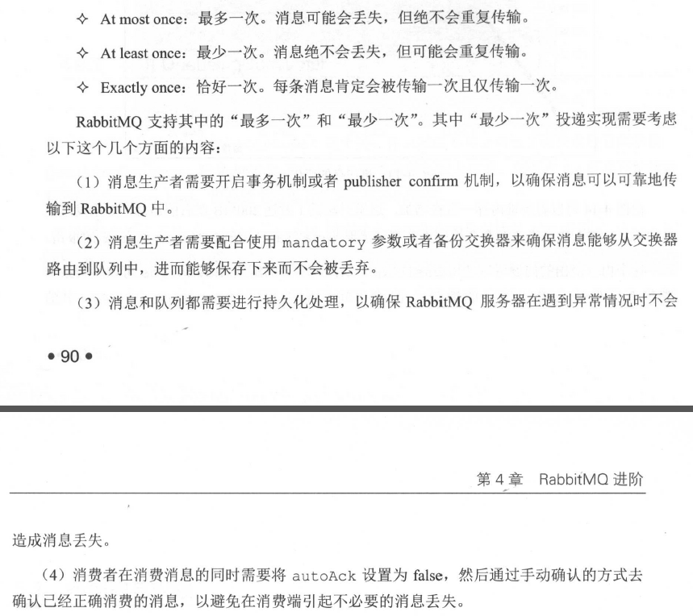
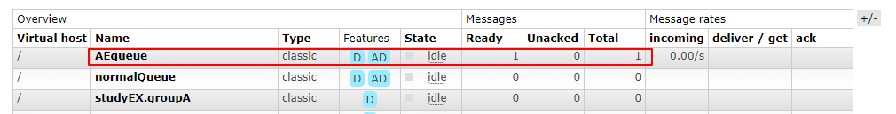
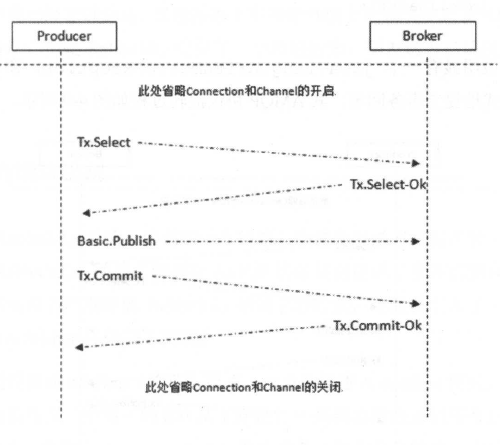
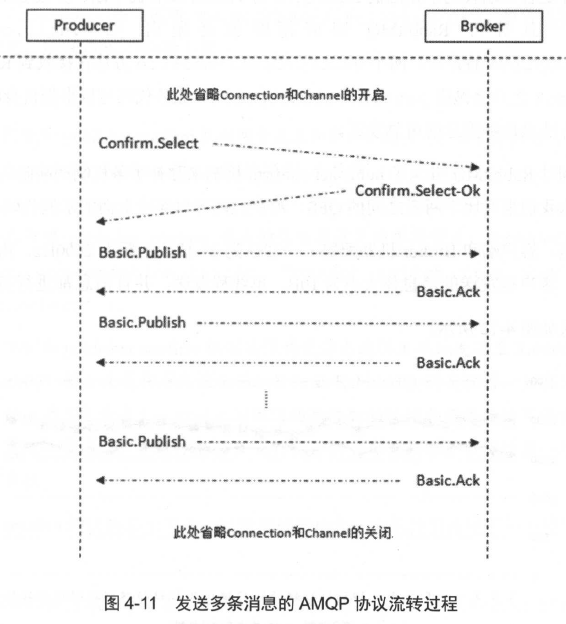

### 1. 第一章 rmq是啥
rmq是使用 ErLang语言实现AMQP的一种消息中间件   
rmq的运行：rabbitmq-server -detached  --->>>加上-detached参数是为了让rmq在后台运行，防止关闭shell窗口后，服务关闭。   
rmq的状态：rabbitmqctl status    
rmq集群信息：rabbitmqctl cluster_status
### 2. 第二章 rmq入门

 基本概念
rmq的依赖引入：
```
<dependency>
  <groupld>com . rabbitmq</groupld>
  <artifactld>amqp-client</artifactid>
  <version>4 . 2 . l</version>
</dependency>
```

1. 生产者：消息发送方
2. 消费者：消息接收方

生产者创建消息，消息一般包括两部分：标签和消息体(payload)，其中消息体是正经需要传递的消息内容，而标签就是用来描述消息体的，比如交换器名称和路由键，rmq就是根据这个标签将消息发送给指定的消费者。

**注意**: 一条消息到达路由器上，然后路由到指定的队列(queue)之后，他的标签就会丢失，也就是说消费者只能拿到消息体，而标签是拿不到的。也就不知道生产者是谁了。

3. Broker:消息中间件的服务节点
每个Broker都可以当做是一个rmq的服务节点，或者rmq实例。
4. 队列：rmq的内部对象，用于存储消息，其实就是我们平时想的那种队列，不要想的太多。因此，当多个消费者订阅同一个队列的时候，队列中的消息会依次被消费者消费，一个消息只能被一个消费者消费，而不是每个消费者收到所有的消息，也就是说rmq其实是不支持广播消费的。相对于rmq的这种消费模式，kafka恰好相反，在kafka中是将消息存在topic层面的，而queue只是一个存储文件的位移标识。

注：rmq中队列有classic 和Quorum两种队列，其中Quorum 是仲裁队列，使用的比较少，估计是用于某些特定场合吧。
5. 交换机：就跟计算机网络中的交换机差不多的概念，生产者生产消息并将消息传给交换机交换机会根据路由键将消息发送给指定的消费者，如果找不到指定的消费者，这条消息有两种结果：一种是被丢弃，一种是被返回给生产者。其次，rmq中有4中类型的交换机，每种交换机的路由机制不一样。
6. Routing key:路由键，当消息发到交换机上时，交换机就是根据这个routing key来将消息发送到指定的queue中(当Routing key和Binding Key一致时，就知道要将消息发到哪里去了)
7. Binding:就是将队列和交换机绑定关联起来。
8. virtualHost:虚拟主机，为了隔离不同的用户之间的操作。每个队列和交换机都有自己的vhost，vhost被删除之后，其所属的队列交换机等会也会被删除掉。
交换机类型

严格来说，交换机类型其实有6种 ，但是这里只介绍其中的4种。

1. fanout 
 这种交换机会将发送到交换机上的消息，发送到所有和此交换机绑定的队列上。
2. direct
 这种交换机会将发送到交换机上的消息，发送到routing key和Binding Key完全匹配的队列上去。
3. topic
这种交换机会将发送到交换机上的消息，发送到routing key和Binding Key模糊匹配的队列上去。
4. headers 
在绑定交换机和队列的时候会指定一组键值对，当消息发送到交换机上时，交换机会取出headers中的键值对，对比其中的键值对和队列交换机绑定时的键值对是否匹配，只有在匹配时才会将消息发送到指定队列中去。这种交换机据说性能比较差。
### 3. 第三章 客户端开发向导
一个Connection可以创建多个channel，但是channel实例并不能在线程间共享，程序应该为每一个线程创建一个channel，如果多个线程强行共享channel的话，可以会造成通信侦交错。换句话说，channel是非线程安全的。

在rmq中交换器的使用并不会消耗服务器的性能，主要的性能损耗还是在队列上，所以衡量rmq的qps主要还是看队列。

代码示例之生产者
```
public class test1 {

 public static ConnectionFactory factory=null;

 public static  void main(String[] args) throws IOException, TimeoutException {
   //创建Connection
   getFactory();
   //创建会话
   Channel channel=getChannel(factory);
   //创建queue和exchange
   createQueueAndExc(channel);
   byte [] messageBodyBytes = "Hello , world !" .getBytes();
   //发送消息
   channel.basicPublish("directTest","directTestOne",null,messageBodyBytes);
   ///////消费者
   /*
   Channel channel1=getChannel(factory);
   DeliverCallback deliverCallback = (consumerTag, delivery) -> {
     String message = new String(delivery.getBody(), "UTF-8");
     System.out.println(" [x] Received '" + message + "'");
   };
   channel.basicConsume("queueTest",true,deliverCallback,cancle->{});
   */
   ///////消费者
 }
  private static void getFactory() {
    factory = connectionFactory.factory;
  }
  private static Channel getChannel(ConnectionFactory factory) throws IOException, TimeoutException {
    Connection connection=factory.newConnection();
    Channel channel=connection.createChannel();
    return channel;
  }
  private static void createQueueAndExc(Channel channel) throws IOException {
    //申明一个exchange
    channel.exchangeDeclare("directTest","direct",true);
    //申明一个queue
    //String queueNmae=channel.queueDeclare().getQueue();
    channel.queueDeclare("queueTest",true,true,true,null);
    //绑定queue和exchange
    channel.queueBind("queueTest","directTest","directTestOne");
  }
}
```
以上需要注意的一个坑是：
```
channel.queueDeclare("queueTest",true,true,true,null);
```
其中第三个参数为：exclusive，设置队列是否为排他。
其详细解释就是：改队列是否会允许其他的Connection来消费消息。当这个属性为true时，就是排他的，也就是说不允许其他连接来操作这个队列的消息，包括在rmq的管理界面上操作也是不行的。

但是如果是同一个Connection的不同channel还是可以对这个queue的消息进行操作的。
如上代码中，放开消费者消息那段代码，公用同一个Connection还是可以收到消息的，否则，会爆出异常
注意：以上代码中，公用同一个ConnectionFactory,并不是公用同一个Connection，但是实际上两个会话是同一个Connection。以通过验证，这里可能是连接池使用了池化之类的技术吧，
```
void basicPublish(Stri 口q exchange , String routingKey, boolean mandatory ,
boolean immediate , BasicProperties props , byte[] body) throws IOException
```
其中，mandatory和immediate需要详细解释下：
1. mandatory为true时，生产者将消息发送到对应的交换机，然后交换机去找队列，如果这时候没有找到对应的队列，那么交换机会将这条消息返回给生产者。如果是mandatory=false时，交换机就直接丢弃这条消息。
如果mandatory为true时，可以通过channel.addReturnListener方法来监听重新入队的消息
```
    channel.basicPublish("directTest","directTestOne",true,null,messageBodyBytes);
    channel.addReturnListener((replyCode, replyText, exchange, routingKey, properties, body) -> {
      String str=new String(body);
      System.out.println("重新入队："+str);
    });
```
2. immediate为true时，生产者将消息发送到对应的交换机，然后交换机去找队列，如果这时候没有发现对应的队列没有消费者，那么这条消息就不发送给这个队列。如果交换机发现匹配到的所有的队列都没有消费者时，就将消息返回给生产者。如果immediate=false时，交换机就直接丢弃了。
rmq3.0版本之后，丢弃了immediate参数。但是使用3.8版本发现还是有这个参数的，并且，使用immediate=false，发现交换器并没有将这条数据丢失。还是在队列中，不过immediate=true时，报异常了。

****消费模式****
rmq中消费模式有两种：推模式和拉模式
#### 推模式：
推模式，其实就是当队列中有消息时，主动推送给消费者。
```
    //声明回调函数，用来处理来自队列的消息
    DeliverCallback deliverCallback = (consumerTag, delivery) -> {
      String message = new String(delivery.getBody(), "UTF-8");
      System.out.println(" [x] Received '" + message + "'");
    };
    //这里其实就是将消费者和消费者对应的回调函数(deliverCallback)、取消回调函数等注册到队列上，也就是绑定。
    channel.basicConsume("queueTest",true,deliverCallback,cancle->{});//在这之前，queueTest队列要求已经存在，否则会报错。并且，这里调用完，并不会阻塞。
```
跟踪源码发现
```
@Override
    public String basicConsume(String queue, final boolean autoAck, String consumerTag,
                               boolean noLocal, boolean exclusive, Map<String, Object> arguments,
                               final Consumer callback)
        throws IOException
    {
        final Method m = new Basic.Consume.Builder()
            .queue(queue)
            .consumerTag(consumerTag)
            .noLocal(noLocal)
            .noAck(autoAck)
            .exclusive(exclusive)
            .arguments(arguments)
            .build();
        BlockingRpcContinuation<String> k = new BlockingRpcContinuation<String>(m) {
            @Override
            public String transformReply(AMQCommand replyCommand) {
                String actualConsumerTag = ((Basic.ConsumeOk) replyCommand.getMethod()).getConsumerTag();
               //这里的_consumers是个syncnizedMap，actualConsumerTag是标记消费者的一个标志,而callback实际上就是消费者的回调函数（deliverCallback）
                _consumers.put(actualConsumerTag, callback);

                // need to register consumer in stats before it actually starts consuming
                metricsCollector.basicConsume(ChannelN.this, actualConsumerTag, autoAck);

                dispatcher.handleConsumeOk(callback, actualConsumerTag);
                return actualConsumerTag;
            }
        };
```
紧接着，能发现_consumers是在processAsync方法中被循环调用
```
            for (Map.Entry<String, Consumer> entry : Utility.copy(_consumers).entrySet()) {
                    this.dispatcher.handleRecoverOk(entry.getValue(), entry.getKey());
                }
                // Unlike all the other cases we still want this RecoverOk to
                // be handled by whichever RPC continuation invoked Recover,
                // so return false
                return false;
```
可以判断processAsync是处理队列消息的时候被调用的。   
综上所述：消费者推模式大概的流程是：    
消费者和队列绑定(channel.basicConsume)------->>>>>>以消费者唯一标识为key，回调函数为value，存放到同步map(_consumers)中。------->>>>>当需要队列中有消息时，调用processAsync方法处理消息，而采用的就是从_consumers中取出消费者，调用消费者的回调函数来做消息处理。


#### 拉模式：
拉模式，其实就是不管队列中有多少条消息，都是消费者主动去队列中拉取消息，而不是队列主动去推送，这就是推和拉之间的区别。  
拉模式有毒，当消费者去取消息的时候，如果队列中没有消息，他就报错。有消息的话就正常取。

发现去拉消息的时候，会将rpc入队的函数，没看明白这是个啥。
```
 private void doEnqueueRpc(Supplier<RpcWrapper> rpcWrapperSupplier) {
        synchronized (_channelMutex) {
            boolean waitClearedInterruptStatus = false;
            while (_activeRpc != null) {
                try {
                    _channelMutex.wait();
                } catch (InterruptedException e) { //NOSONAR
                    waitClearedInterruptStatus = true;
                    // No Sonar: we re-interrupt the thread later
                }
            }
            if (waitClearedInterruptStatus) {
                Thread.currentThread().interrupt();
            }
            _activeRpc = rpcWrapperSupplier.get();
        }
    }
```
拉模式流程：
先doEnqueueRpc，然后通过_activeRpc去取消息来着。估计就是直接通过非抢占式rpc之类的去broker取消息。

**注：**当多个消费者消费同一个队列时，正常情况下采用轮训的方式拿消息，但是也可以通过设备消费者优先级或者设置Single active consumer来控制消费者消费消息的规则，其中消费者优先级没什么好说的，Single active consumer是将某个消费者设置为队列的排他消费者(exclusive consumer)，也就是说，只能由这个消费者消费改队列消息，其他消费者是拿不到消息的。

### qos：每秒查询率
限制消费者未确认消息条数，当一个消费者消费了n调消息之后，而qos=n，那么服务端就不会再给这个消费者发消息了，当消费者向服务器确认了消息时n-1

### 消费端的消息确认机制
为了确保消息送到消费端，rmq提供了消息确认机制。
当消费者在订阅队列的时候，可以通过autoAck参数，来指定是否由消费端指定消息已收到。
当autoAck=true时，队列将消息给到消费端，就直接判断当前消息已收到，标记其为已删除，然后从内存或者磁盘中删除掉。
当autoAck=false时，队列必须要等消费端的确认消息，等不到就一直等，当没等到确认消息，而消费者就断开连接时，这个消息重新进去队列，重新排队。   
当然，消费者收到消息后，也是可以拒绝接受消息的。而之后这条消息的去处就不好说了，根据参数设定来。
### 消息的顺序性
消息的顺序性是指：生产者发送的消息和消费者接收到的消息的顺序是一致的。
一般来说，rmq中消息的顺序性是能得到保证的。但是，这里是指，生产者已经将消息发送到了队列上，然后消费者拿到的和队列中的消息顺序是一致的。但是在消息没有进入到队列之前，会受到各种因素影响，导致生产者发送的消息进入到队列中的顺序不一定。比如，消息发送的过程中出现问题，导致回滚，重新发送，那么本来是这个回滚的消息顺序靠前，但是现在就可能是队列中最后一个了。
总而言之：只有当消息进入到队列之后才会保证顺序性。
### 消息保障


注意：目前rmq是不能保证恰好一次的
### 消费端的消息拒绝
```
void basicReject(long deliveryTag, boolean requeue) throws IOException
```
消息拒绝，requeue决定是丢弃还是重新入队。    
requeue=true，重新入队     
requeue=false,直接丢弃，被丢弃不代表消息丢失，可以通过设置私信队列来处理被拒绝的消息
```
Basic.RecoverOk basicRecover(boolean requeue) throws IOException;
```
重新入队：     
requeue=true时，重新入队的消息可能会被与之前不同的消费者消息；  
requeue=false时，重新入队的消息还是会被之前的消费者消费。
### 备份交换器
生产者将生产的消息发送到交换器，如果由于路由错误不能到达指定队列，那么就会被发送到备份交换器
有两种方式设置备份交换器：
1. 申明交换器时通过参数alternate-exchange来使用
```
    Map<String, Object> args = new HashMap<String, Object>();
    args.put("alternate-exchange","testAE");
    channel.exchangeDeclare ( "normalExchange ","direct ", true, false, args);
```
测试代码如下：
```
public class alternExchangeDemo {
  public static ConnectionFactory factory=null;
  public static void main(String[] args) throws IOException, TimeoutException {
    getFactory();
    Channel channel=getChannel(factory);
    createQueueAndExc(channel);
    byte [] messageBodyBytes = "备份交换器" .getBytes();
    //当使用mandatory和备份交换器时，mandatory参数无效，也就是说mandatory的值没有意义
    channel.basicPublish("normalExchange","normal",true,null,messageBodyBytes);
  }
  private static Channel getChannel(ConnectionFactory factory) throws IOException, TimeoutException {
    Connection connection=factory.newConnection();
    Channel channel=connection.createChannel();
    return channel;
  }
  private static void getFactory() {
    factory = connectionFactory.factory;
  }
  private static void createQueueAndExc(Channel channel) throws IOException {
    //申明一个exchange
    channel.exchangeDeclare("testAE","fanout",true);
    channel.queueDeclare("AEqueue",true,false,true,null);
    channel.queueBind("AEqueue","testAE","ae");
    Map<String, Object> args = new HashMap<>();
    args.put("alternate-exchange","testAE");
    //绑定备份交换器
    channel.exchangeDeclare ( "normalExchange","direct", true, false, args);
    //申明一个queue
    channel.queueDeclare("normalQueue",true,false,true,null);
    //不绑定交换器和队列
    //channel.queueBind("normalQueue","normalExchange","normal");
  }
}
```
查看queue时，发现数据已经给到了备份交换器绑定的队列上

注意：  mandatory和备份交换器同时使用时，mandatory无效。   
2. 通过策略来使用

```
rabbitmqctl set_policy AE "< norma l Exchange &" '｛" alternate-exchange " ："myAE "｝'
```
备份交换器和普通的交换器是一样的。不一样的地方在于：mandatory和备份交换器同时使用时，mandatory无效。
### 消息的TTL
消息的TTL就是消息过期时间
当消息到达queue中后，开始计时，超过TTL设置时长就会被丢弃(其实也能从死信队列中拿到)
1. 通过设置队列的ttl设置消息的失效，这种方法设置的是队列中所有的消息时效都是一样的
```
    //消息ttl参数
    Map<String,Object> args=new HashMap<>();
    args.put("x-message-ttl",3000);
    //申明一个queue
    channel.queueDeclare("normalQueue",false,false,true,args);
```
2. 通过设置单条消息的时效，针对单个消息有效
```
    byte [] messageBodyBytes = "message sended" .getBytes();
    AMQP.BasicProperties properties=new AMQP.BasicProperties().builder().expiration("3000").build();
    channel.basicPublish("normalExchange","normal",false,properties,messageBodyBytes);
```
注意：
1. 如果同时使用以上两种方法设置消息过期时间，那么，以两者中ttl较小的为准。
2. 除了使用这种方式设置消息的有效时长，还可以通过策略和API的方法设置。
3. 通过设置队列参数和设置消息的参数，这两种过期时间设置方法有点区别，区别在于：设置队列的参数这种方法，消息一旦过期就立马被丢弃，因为每条队列中每条消息过期时间一样，所以队列中过期的消息是在队列头部，可以直接去删除。而第二种方式，因为队列中每条消息的过期时间不一样，需要去扫描，这样的话还不如等到消息要被消费者消费的时候，再去删除，这样就方便多了。总而言之，就是消息被删除的时机不一样。

### 队列的TTL
不仅仅是消息有过期时间，队列也有过期时间。如果在有效时间内，队列未被使用就会被删除的。这里的未使用的概念是：在这段时间内，队列没有消费者，没有重新申明，也没有被调用Basic.get指令。当然如果服务重启的话，这个时间就要重新计算了。
```
Map<String, Object> args ＝口ew HashMap<String, Object>{);
args.put ("x-expires", 1800000);
channel.queueDeclare ("myqueue", false, false, false, args) ;
```
### 死信队列
当消息在队列中变成死信时，就会被重新publish到另外一个exchange中去，这个exchange就是DLX，而与这个交换机绑定的queue就是死信队列了。一般正常消息变成死信的方式有以下几种：
1. 消息被消费者拒绝并且requeue=false
2. 消息TTL过期，
3. 队列消息饱和达到最长(队列长度在申明队列时，可通过参数设置)
```
    channel.exchangeDeclare ( "normalExchange","fanout");
    //消息ttl参数
    Map<String,Object> args=new HashMap<>();
    args.put("x-message-ttl",3000);
    //死信参数设置，注意，这里的死信参数设置是设置到正常的queue中。而不是设置到queue.dlx中
    args.put("x-dead-letter-exchange","exchange.dlx");
    args.put("x-dead-letter-routing-key","dlx");
    //申明一个queue
    channel.queueDeclare("normalQueue",false,false,true,args);
    //绑定queue和exchange
    channel.queueBind("normalQueue","normalExchange","normal");
    channel.exchangeDeclare("exchange.dlx","direct",false);
    channel.queueDeclare("queue.dlx",false,false,true,null);
    channel.queueBind("queue.dlx","exchange.dlx","dlx");
```
这里设置了死信到达死信队列的routerKey,只有发送的消息满足routerKey才能发送到。不过也可以将DLX设置为fount类型的。
### 延迟队列
延迟队列其实是死信队列的一种巧妙用法，就是将消息设置超时时间，当超时时间到了之后，消息就会到死信队列中，那么这个消息的超时时间就是延时时间了。死信队列也就成了延时队列，就是这么回事。

### 持久化
rmq中持久化包含3个方面：交换器、队列、消息：
对于交换器和队列的持久化，是在申明交换器和队列的时候通过参数durable指定的。durable=false时，服务重启，对应的交换器或者队列就丢了。这两者的区别在于：交换器丢了，只是消息发不到这个交换器上而已，但是队列要是丢了，那么队列上的消息就会丢了。
消息的持久化就是在消息发送的时候，根据deliveryMode这个参数设置。
```
AMQP.BasicProperties.Builder properties = new AMQP.BasicProperties().builder();
properties.deliveryMode(2);  // 设置消息是否持久化，1： 非持久化 2：持久化
channel.basicPublish(EXCHANGE_NAME, "", properties.build(), message.getBytes("UTF-8"))
```
而实际上MessageProperties.PERSISTENT_TEXT_PLAIN封装了消息持久化，所以通过设置MessageProperties.PERSISTENT_TEXT_PLAIN参数也能实现消息的持久化。
一般单单设置消息的持久化没啥用，也要设置队列的持久化，因为队列没了，消息也就没了。而且就算是消息和队列都设置了持久化，也并不能保证消息不丢失，因为消息可能在发送的过程中丢失，而且，也并不是所有的消息都会进行存盘的，可能仅仅是存入操作系统的缓存中，并没有刷新到磁盘中。针对这种情况可以通过发送方的事务机制和消费者方的消息确认机制来保证。不过一般都是采用镜像队列的方式确保消息的持久化。

#### 消息从生产者到服务器的保证
有两种方式确保消息已经到达服务器：
1. 事务机制
  事务相关的三个方法为：
   channel.txSelect();//将当前通道设置为事务模式
   channel.txCommit(); //事务提交
   channel.txRollback(); //事务回滚

   

注意：事务的性能消耗比较大，最好是使用生产者确认机制来确保消息发送到了服务器上。
2. 生产者确认机制
事务的消耗也太大了，还是采用生产者确认机制比较好
首先，也是要将通道设置为确认模式(confirm)，然后就尽情的发送消息好了，注意，这里和事务不同的地方在于，此处是异步的，如果有多条消息，我只要发送就行了，在最后等待服务器的回应就行，而事务是，每发送完一条就阻塞，正常发送完再发送下一条。
```
channel . confirmSelect();//将信道设置为confirm模式
channel.waitForConfirms()//等待消息确认
```
可以通过添加Listerner来监听服务器返回给生产者的消息
```
channel.addConfirmListener()//消息确认回调函数
```
测试
```
    channel.confirmSelect();
    for(int i=0;i<100000;i++){
      channel.basicPublish("normalExchange","normal",false,null,messageBodyBytes);
    }
    if(channel.waitForConfirms()){//在这里确实会阻塞的
      System.out.println("over");
    }
```


#### 消息从服务器到消费者的保证

### 4. 第六章 rmq配置
 rmq提供了3中方式定制化服务：
 1. 环境变量
    可以在rabbitmq-env.conf文件中修改环境变量，也可以在服务启动的时候指定环境变量
 2. 配置文件
    rabbitmq.config
    可以对配置文件中某些敏感信息进行加密(在文本中以密文的形式出现)
 3. 运行时参数和策略
    有vhost和global级别的参数设置

### 4. 第七章 rmq运维

1. 创建队列时，只有该队列所在的节点有该队列的数据，其他节点并不会有该队列的数据，只会有队列的绑定关系和名称等元数据。所以当队列所在节点奔溃时，其队列上的数据就会丢失。只能通过其他的方法保证消息不会丢失。
2. 在局域网中，rmq推荐使用rmq集群方式部署，在广域网中推荐使用Federation和Shovel。
3. 集群节点类型分为内存节点和磁盘节点。内存节点的意思是：将队列、交换器、绑定关系和用户等数据存放在内存中，磁盘节点就是将这些数据存放在磁盘中。注意这里指的是队列等数据，并不包括发送的数据。其次，如果是单节点的话，那就只能是磁盘节点，否则服务器重启后，这些数据就全丢了。
#### 集群迁移
集群迁移包括元数据的迁移和数据的迁移
1. 元数据迁移  
  1.1 可以直接在web界面上下载元数据信息，然后在通过web界面导入元数据，但是这种方式存在比较大的问题，版本不同元数据可能不一样，并且在集群中这种方式会将所有的元数据放到单个节点上。    
  1.2 最好是采用编程实现元数据的获取。
2. 数据迁移和客户端连接切换    
2.1 数据迁移是先把生产者断开，重新绑定到新的连接上，然后通过其他方式将已经发出去的mq消息取出重新放入新的连接队列中。
3. 还可以通过zk来实时感应队列，交换器等主要信息的变更。
### 5. 第八章 rmq分布式部署
rmq实现分布式部署有3种方式：
1. 集群
2. Federation
3. Shovel
这三种实现并不会产生冲突，可以并存，其中Federation和Sovel灵活性更大但是也更复杂。

### 6. 第九章 rmq高阶
#### 1.消息持久化：
任何消息都会被持久化，但是持久化的时机不一致，当发布消息时设备消息持久化，当该消息到达队列时，会立即被存储到磁盘上，当然，如果内存还有容量的话，也可能会将此消息放到内存中。若消息发布时未设置持久化属性，当消息到达队列时，是存储在内存中的并不会立即被持久化，只有等内存不太够用时才会将该消息放到磁盘中。
#### 2. 惰性队列
惰性队列会将到达队列的消息直接存放到磁盘中而不是放在内存中，这样就大大的降低了内存开销。因为普通队列将消息存放在内存中，当内存容量不够需要将内存中的消息刷入磁盘的时候，此时是不会接受新的消息的。

rmq可以设置内存阈值，当内存到达一定使用量时，可以阻止生产者发送消息。
#### 3. 镜像队列
1. 消息发送时，会同时发送到master和slave节点中，但是除此之外，其他的任何动作都是先到达master，由master处理完，再返回到客户端。
2. 当master节点挂了之后，会选举资历最老(创建时间最早)的节点为master节点。此处选择创建时间最早的节点为主节点，可能是因为最早的节点中信息最全。
3. 在生产者消息确认和事务机制中，只有当所有的节点都收到执行后才会返回确认。

### 7.第10章 网络分区

1. rmq的集群最好是在lan网络环境下，wan网络中需要借助于插件实现了(Federation和Shovel)。
2. 节点之间通过端口25672实现心跳检测，每隔1/4 net ticktirne时间就会进行信息交互。如果超过4次没有应答，该节点就会被认为是down。
3. 一旦两个节点超时没有应答，节点双方就会认为彼此都挂了。也就是产生了网络分区。但是当两个节点之间恢复通信之后，两个节点之间还是认为对方已经挂了。

