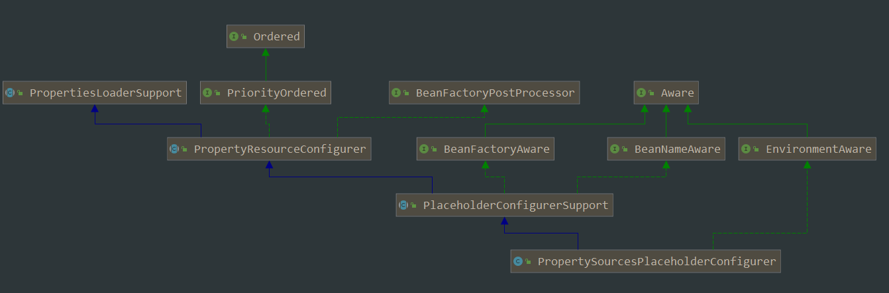
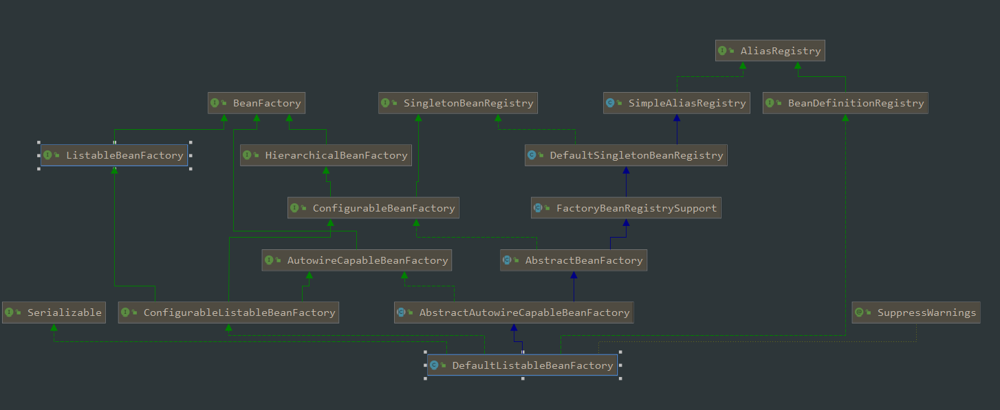
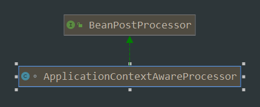
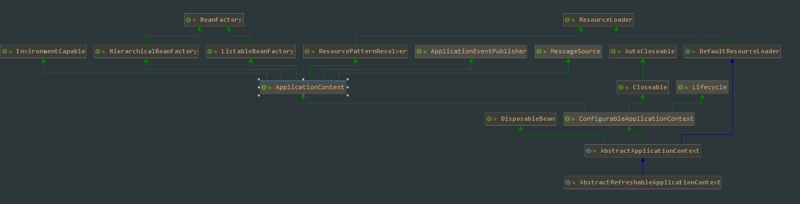
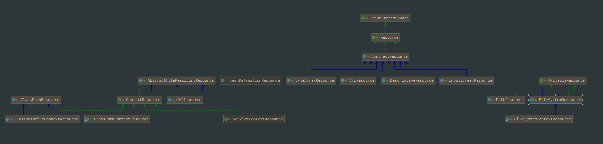

1. PropertySourcesPlaceholderConfigurer类：根据源码注释为：PlaceholderConfigurerSupport类的定制版本，负责解析bean定义属性和@Value注解

2. DefaultListableBeanFactory类：

3. BeanPostProcessor

BeanPostProcessor：在实例化bean的前后，可以加入自己的实现逻辑。

4. 资源加载

